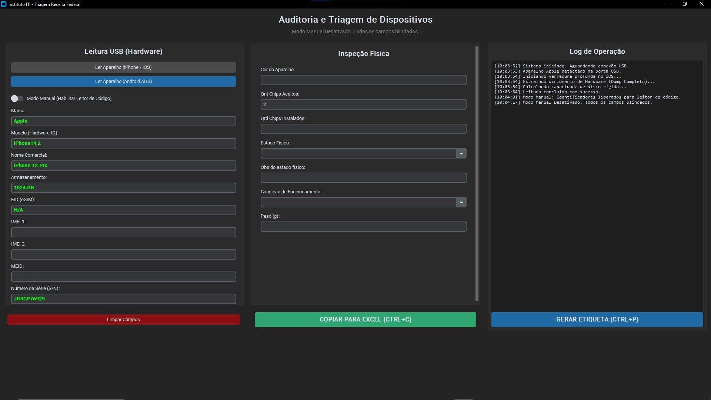
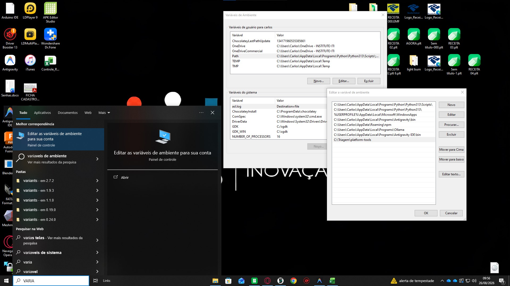

# Sistema de Triagem e Auditoria de Dispositivos Móveis 📱🔍
### Instituto ITI — Operação Receita Federal

> Ferramenta de chão de fábrica para extração automatizada de dados de hardware (IMEI, EID, MEID, Número de Série) diretamente da placa-mãe via cabo USB, com integração a um sistema de estoque via API REST, exportação para Excel e geração de etiquetas térmicas.

---



---

## Índice

1. [O que é e como funciona](#-o-que-é-e-como-funciona)
2. [Estrutura do Repositório](#-estrutura-do-repositório)
3. [Pré-requisitos](#-pré-requisitos)
4. [Guia de Instalação Completo](#-guia-de-instalação-completo)
   - [Passo 1 — Python](#passo-1--instalar-o-python)
   - [Passo 2 — Dependências Python](#passo-2--instalar-as-dependências-python)
   - [Passo 3 — Driver para iPhone (iTunes)](#passo-3--driver-para-iphone-suporte-apple)
   - [Passo 4 — Configurar o PATH do Windows](#passo-4--configurar-o-path-do-windows)
5. [Como Executar](#-como-executar)
6. [Guia de Uso da Interface](#-guia-de-uso-da-interface)
   - [Painel: Leitura USB](#-painel-leitura-usb-hardware)
   - [Painel: Inspeção Física](#-painel-inspeção-física)
   - [Painel: Log de Operação](#-painel-log-de-operação)
   - [Exportação para Excel](#-exportação-para-excel)
   - [Salvar no Sistema](#-salvar-no-sistema-api)
   - [Geração de Etiqueta](#-geração-de-etiqueta-térmica)
7. [Atalhos de Teclado](#-atalhos-de-teclado)
8. [Configuração da API](#-configuração-da-api-configjson)
9. [Teste Offline (Servidor Mock)](#-teste-offline-servidor-mock)
10. [Solução de Problemas](#-solução-de-problemas)

---

## 📌 O que é e como funciona

O sistema substitui a anotação manual de dados de hardware durante a triagem de lotes de celulares da Receita Federal. Em vez de digitar IMEI, número de série e modelo à mão (sujeito a erros humanos), o operador conecta o aparelho via **cabo USB** e clica em um botão — a ferramenta lê os dados diretamente da memória da placa-mãe.

**Para iPhones:** utiliza o motor `ideviceinfo` (da suíte `libimobiledevice`), que se comunica com o protocolo lockdown da Apple.

**Para Androids:** utiliza o `adb` (Android Debug Bridge) via protocolo de depuração USB.

Os dados extraídos são exibidos na tela, permitindo complementação com inspeção física (cor, estado, avarias). Ao clicar em **"SALVAR NO SISTEMA"**, o formulário completo é enviado para a API de estoque, que registra a triagem e retorna um **ID de patrimônio** — usado automaticamente para gerar e imprimir a etiqueta térmica.

---

## 📁 Estrutura do Repositório

```
C:\Triagem\
│
├── painel_triagem.py       # Interface gráfica principal (execute este arquivo)
├── servidor_mock.py        # Servidor de teste local para uso offline
├── extrator.py             # Motor de extração via ADB (uso legado/CLI)
├── requirements.txt        # Dependências Python
├── config.json             # Configurações do app (API, impressora, patrimônio)
│
├── platform-tools\         # Ferramentas de comunicação USB (ADB + libimobiledevice)
│   ├── adb.exe             # Motor Android (ADB)
│   ├── fastboot.exe
│   ├── ideviceinfo.exe     # Motor iOS (libimobiledevice)
│   ├── idevice_id.exe
│   ├── idevicepair.exe
│   └── *.dll               # Bibliotecas necessárias para os executáveis iOS
│
├── etiquetas\              # PNGs de etiquetas gerados automaticamente
└── docs\
    └── images\             # Imagens usadas nesta documentação
```

> **Por que a pasta `platform-tools` está aqui?**
> Para facilitar a instalação em novos computadores da bancada. Não é necessário baixar nada separadamente — tudo já está no repositório. Basta clonar e configurar o PATH conforme o [Passo 4](#passo-4--configurar-o-path-do-windows).

---

## ✅ Pré-requisitos

| Requisito | Versão Mínima | Observação |
|---|---|---|
| Windows | 10 ou 11 | 64-bit obrigatório |
| Python | 3.10+ | Com "Add to PATH" marcado na instalação |
| iTunes / Apple Devices | Qualquer | Apenas para leitura de iPhones |
| Cabo USB | — | Qualidade adequada (não adaptadores genéricos) |
| Depuração USB (Android) | — | Ativada nas opções de desenvolvedor do celular |

---

## 🛠️ Guia de Instalação Completo

### Passo 1 — Instalar o Python

1. Acesse [python.org/downloads](https://www.python.org/downloads/) e baixe a versão mais recente do Python 3.
2. Execute o instalador.
3. **CRÍTICO:** Na primeira tela do instalador, marque a caixa **"Add Python to PATH"** antes de clicar em *Install Now*.

   > ⚠️ Se esquecer de marcar essa opção, precisará reinstalar o Python ou configurar o PATH manualmente.

4. Após a instalação, abra o **Prompt de Comando** (cmd) e confirme:
   ```cmd
   python --version
   ```
   Deve exibir algo como `Python 3.12.x`.

---

### Passo 2 — Instalar as Dependências Python

Com o Python instalado, abra o **Prompt de Comando** dentro da pasta `C:\Triagem` e execute:

```cmd
cd C:\Triagem
python -m pip install -r requirements.txt
```

Isso instalará automaticamente:
- **`customtkinter`** — framework da interface gráfica moderna
- **`autocorrect`** — motor de autocorreção ortográfica do campo de observações
- **`reportlab`** — geração das etiquetas
- **`Pillow`** — processamento de imagens para etiquetas térmicas
- **`qrcode`** — geração de QR Code nas etiquetas
- **`requests`** — comunicação com a API de estoque
- **`pywin32`** — impressão direta via Windows (impressoras térmicas)

---

### Passo 3 — Driver para iPhone: Suporte Apple

O Windows precisa de um driver instalado para reconhecer iPhones na porta USB. Existem duas formas de obter esse driver:

#### ✅ Opção Recomendada — Apple Devices (Microsoft Store)

É a versão oficial e mais leve. Instala **apenas os drivers USB**, sem os serviços e processos secundários do iTunes completo.

1. Abra a **Microsoft Store** (menu Iniciar → "Microsoft Store").
2. Pesquise por **"Apple Devices"** (ou "Dispositivos Apple").
3. Clique em **Instalar** e aguarde.
4. Reinicie o computador.

#### Opção Alternativa — iTunes Clássico

Se o Apple Devices não estiver disponível na sua região ou versão do Windows:

1. Acesse [apple.com/br/itunes](https://www.apple.com/br/itunes/).
2. Baixe e instale o iTunes.
3. Após a instalação, o driver **Apple Mobile Device Support** é registrado automaticamente no Windows.

> **Por que o iTunes é necessário para iPhone?**
> O protocolo de comunicação da Apple (`usbmuxd`) exige que o driver **Apple Mobile Device Support** esteja instalado e rodando no Windows. O motor `ideviceinfo.exe` — que vem na pasta `platform-tools` — se comunica com esse driver para ler os dados do aparelho. Sem ele, o iPhone simplesmente não é reconhecido.

---

### Passo 4 — Configurar o PATH do Windows

Esta é a etapa que permite o Python encontrar os executáveis `adb.exe` e `ideviceinfo.exe` em qualquer diretório.



**Siga os passos:**

1. Pressione `Win` e digite **"variáveis de ambiente"**, depois clique em **"Editar as variáveis de ambiente do sistema"**.

2. Na janela **Propriedades do Sistema**, clique no botão **"Variáveis de Ambiente..."**.

3. Na seção **"Variáveis do sistema"** (parte de baixo), localize a variável **`Path`** e clique em **"Editar..."**.

4. Na janela de edição, clique em **"Novo"** e adicione exatamente este caminho:
   ```
   C:\Triagem\platform-tools
   ```

5. Clique **OK** em todas as janelas para salvar.

6. **Feche e reabra** qualquer terminal ou editor de código aberto. O Windows carrega o PATH apenas na abertura do terminal.

**Para verificar se funcionou**, abra um novo cmd e execute:
```cmd
adb version
ideviceinfo --version
```
Ambos devem exibir informações de versão sem erros.

---

## ▶️ Como Executar

Navegue até a pasta do projeto e execute o painel principal:

```cmd
cd C:\Triagem
python painel_triagem.py
```

Ou clique duas vezes no arquivo `painel_triagem.py` se o Python estiver associado a arquivos `.py` no Windows.

---

## 🖥️ Guia de Uso da Interface


A interface é dividida em **três painéis** e uma **barra de ações** no rodapé.

---

### 📟 Painel: Leitura USB (Hardware)

Localizado à **esquerda**. É o coração da ferramenta.

| Elemento | Função |
|---|---|
| **Ler Aparelho (iPhone / iOS)** | Aciona o motor `ideviceinfo` para extrair dados do iPhone conectado |
| **Ler Aparelho (Android ADB)** | Aciona o ADB para extrair dados do Android conectado |
| **Modo Manual** | Libera todos os campos para digitação/leitura manual com leitor de código de barras |
| **Marca / Nome Comercial / Modelo Físico** | Dropdowns inteligentes com busca fuzzy, populados pela API |
| **Armazenamento / RAM** | Preenchidos automaticamente; RAM extraída do Android via `/proc/meminfo` |
| **Campos verdes** | Dados extraídos automaticamente (protegidos contra edição acidental) |

**Fluxo para iPhone:**
1. Conecte o iPhone via cabo USB.
2. Na tela do iPhone, confirme **"Confiar neste computador"** (na primeira vez).
3. Aguarde o status mudar para `Aparelho Apple detectado`.
4. Clique em **"Ler Aparelho (iPhone / iOS)"**.
5. Os campos são preenchidos automaticamente em segundos.

**Fluxo para Android:**
1. Ative a **Depuração USB** no aparelho (Configurações → Opções do Desenvolvedor → Depuração USB).
2. Conecte via cabo e autorize o acesso na tela do celular quando solicitado.
3. Clique em **"Ler Aparelho (Android ADB)"**.

> **Nota sobre IMEI no Android 10+:** O Android 10 e superior bloqueou o acesso ao IMEI por software. Para esses dispositivos, o IMEI deve ser informado via leitor de código de barras usando o **Modo Manual**.

---

### 📋 Painel: Inspeção Física

Localizado ao **centro**. Preenchido manualmente pelo operador durante a vistoria do aparelho.

| Campo | O que informar |
|---|---|
| **ID Responsável Técnico** | Número de identificação do operador que realizou a triagem |
| **Caixa de Recebimento** | Lote/caixa de origem do aparelho (lista da API) |
| **Cor do Aparelho** | Dropdown com cores da API (ex: `Preto`, `Branco`, `Azul`) |
| **Chips Aceit. / Chips Inst. / Peso** | Capacidade de chips, chips instalados e peso em gramas |
| **Estado Físico** | `Excelente / Bom / Regular / Ruim / Sucata` (lista da API) |
| **Condição de Funcionamento** | `Excelente / Liga Parcialmente / Não Liga / Bloqueado` |
| **Estado de Acesso** | `Desbloqueado / Bloqueado por Senha / iCloud Ativo / FRP Ativo` |
| **Observações Adicionais** | Texto livre com autocorreção aplicada ao exportar |
| **Avarias Identificadas** | Checkboxes dinâmicos carregados da API; filtrável por busca em tempo real |

**Cadastrar nova avaria:** Digite o nome no campo de busca de avarias e clique no botão **`+`**. A avaria é salva na API e aparece imediatamente na lista.

---

### 📜 Painel: Log de Operação

Localizado à **direita**. Registra automaticamente cada evento com horário:
- Conexões e desconexões de dispositivos detectados pelo radar USB
- Início e conclusão de leituras
- Exportações para Excel
- Salvamentos na API (com ID de estoque retornado)
- Geração de etiquetas
- Erros e avisos

---

### 📊 Exportação para Excel

Com todos os campos preenchidos, clique em **"COPIAR PARA EXCEL"**.

O sistema copia para a área de transferência uma linha com **16 colunas separadas por tabulação**, na seguinte ordem:

```
Tipo | Marca | Modelo | Nome Comercial | Cor | IMEI 1 | IMEI 2 | MEID | EID | Série | Qnt Chips | Chips Inst | Estado | Obs+Avarias | Condição | Peso
```

Para colar na planilha: clique na célula da primeira coluna da linha vazia no Excel e pressione `Ctrl+V`.

> **Sobre o campo EID:** O valor é colado com um apóstrofo (`'`) prefixado automaticamente, para evitar que o Excel interprete o número de 32 dígitos do eSIM como notação científica.

---

### 💾 Salvar no Sistema (API)

Clique em **"SALVAR NO SISTEMA"** para enviar o formulário completo para a API de estoque.

**O que acontece:**
1. Os dados do formulário são empacotados em JSON e enviados via `POST /api/triagem/triagem`.
2. A API registra a triagem no banco de dados e retorna um **ID de estoque**.
3. O app exibe o ID no log e **automaticamente ajusta o Nº de Patrimônio** para esse ID.
4. A etiqueta térmica é gerada e enviada para a impressora automaticamente.

> ⚠️ O **IMEI 1** deve estar preenchido para que a etiqueta seja gerada após o salvamento.

---

### 🏷️ Geração de Etiqueta Térmica

Clique em **"GERAR ETIQUETA"** ou pressione `Ctrl+P` para gerar e imprimir uma etiqueta **58,6mm × 40mm** diretamente na impressora térmica configurada.

A etiqueta contém:
- Nome da instituição
- Marca e modelo comercial do aparelho
- Capacidade de armazenamento
- Número de série e estado físico
- **QR Code** com o ID do item no estoque
- Nº de Patrimônio (`ITI TECH-XXX`)

Os PNGs de referência são salvos automaticamente em `etiquetas\`.

**Calibrar a impressão:** Clique no botão **⚙** para ajustar as dimensões da etiqueta, offsets e escala do conteúdo. As configurações são salvas em `config.json`.

> ⚠️ É obrigatório ter o **IMEI 1** preenchido para gerar a etiqueta.

---

## ⌨️ Atalhos de Teclado

| Atalho | Ação |
|---|---|
| `Enter` (nos campos de ID) | Avança para o próximo campo automaticamente |
| `↑` / `↓` (nos campos de patrimônio) | Incrementa / decrementa o número de patrimônio |
| `↑` / `↓` (nos dropdowns de estado) | Navega entre as opções sem usar o mouse |
| `Ctrl+P` | Gera e envia a etiqueta para a impressora |
| `F5` | Recarrega as listas dinâmicas da API (marcas, cores, avarias, etc.) |

---

## ⚙️ Configuração da API (`config.json`)

Todas as configurações do app ficam no arquivo `config.json` na raiz do projeto. Ele é criado automaticamente na primeira execução com valores padrão.

```json
{
  "impressora": "4BARCODE 4B-2054L",
  "largura_mm": 58.6,
  "altura_mm": 40.0,
  "offset_x_mm": 0.0,
  "offset_y_mm": 2.0,
  "patrimonio_num": 10,
  "escala_conteudo": 1.2,
  "api_url": "https://seu-servidor.ngrok-free.app/api",
  "app_titulo": "Instituto ITI - Triagem Receita Federal",
  "app_geometria": "1920x1080"
}
```

| Chave | Descrição |
|---|---|
| `impressora` | Nome exato da impressora térmica conforme aparece no Windows |
| `largura_mm` / `altura_mm` | Dimensões físicas da etiqueta em milímetros |
| `offset_x_mm` / `offset_y_mm` | Ajuste fino de posição da impressão |
| `escala_conteudo` | Escala do conteúdo da etiqueta (1.0 = 100%) |
| `patrimonio_num` | Último número de patrimônio usado (salvo automaticamente) |
| `api_url` | URL base da API de estoque |
| `app_titulo` | Título exibido na barra da janela |
| `app_geometria` | Geometria inicial da janela |

> O app lê o `config.json` a cada inicialização. Para trocar de servidor, basta editar o campo `api_url` — sem necessidade de alterar o código.

---

## 🧪 Teste Offline (Servidor Mock)

Quando o servidor de produção não estiver disponível, é possível testar o app completamente offline usando o **servidor mock** incluído no repositório (`servidor_mock.py`).

### Como usar

**1. Inicie o servidor mock** (num terminal separado):

```cmd
cd C:\Triagem
python servidor_mock.py
```

Você verá:
```
=======================================================
  Servidor MOCK da Triagem - Modo Offline
=======================================================
  URL base : http://localhost:5000/api
  Coloque no config.json:
    "api_url": "http://localhost:5000/api"
=======================================================
```

**2. Aponte o app para o mock** — edite `config.json`:

```json
"api_url": "http://localhost:5000/api"
```

**3. Inicie o painel normalmente** (em outro terminal):

```cmd
python painel_triagem.py
```

### O que o mock simula

| Endpoint | Comportamento |
|---|---|
| `GET /api/triagem/dominios` | Retorna marcas, cores, estados, avarias e caixas pré-populados |
| `GET /api/triagem/marcas/{marca}/modelos` | Retorna modelos de Apple, Samsung, Motorola, Xiaomi |
| `GET /api/triagem/modelos/{modelo}/modelos-fisicos` | Retorna hardware IDs (ex: `iPhone14,5`, `SM-A546B`) |
| `POST /api/triagem/triagem` | Aceita o formulário e retorna um ID de estoque começando em **100** |
| `POST /api/triagem/avarias` | Adiciona nova avaria na memória da sessão atual |

> Os dados do mock são armazenados **em memória** — ao reiniciar o servidor, tudo volta ao estado inicial. Isso é suficiente para todos os testes funcionais.

### Para voltar ao servidor real

Basta atualizar o `config.json` com a URL de produção:

```json
"api_url": "https://seu-servidor.ngrok-free.app/api"
```

Reinicie o app. Nenhuma outra alteração é necessária.

---

## 🔧 Solução de Problemas

### ❌ "Falha Crítica: Motor ideviceinfo ausente no PATH"
O executável `ideviceinfo.exe` não foi encontrado. Verifique:
- Se `C:\Triagem\platform-tools` foi adicionado ao PATH do **sistema** (não ao PATH do usuário).
- Se o terminal foi reaberto **após** adicionar ao PATH.
- Se o arquivo `ideviceinfo.exe` está de fato dentro de `C:\Triagem\platform-tools\`.

### ❌ iPhone não reconhecido / "Falha de Comunicação"
- Verifique se **Apple Devices** ou **iTunes** está instalado.
- Confirme se aparece a caixa "Confiar neste computador" na tela do iPhone.
- Tente outro cabo USB (cabos de baixa qualidade frequentemente causam falhas de comunicação).
- Verifique se o serviço **Apple Mobile Device** está rodando: `Win+R` → `services.msc` → procure por "Apple Mobile Device Service".

### ❌ Android mostra "IMEI bloqueado pelo Android 10+"
Comportamento esperado. O Android 10 e superior restringe o acesso ao IMEI por software de terceiros. Use o **Modo Manual** e o leitor de código de barras para inserir o IMEI, que geralmente está impresso na embalagem ou na etiqueta interna do aparelho.

### ❌ "Aviso: Falha ao carregar domínios da API"
O app não conseguiu conectar na `api_url` configurada. Verifique:
- Se o servidor de produção está online.
- Se a URL no `config.json` está correta (URLs ngrok mudam a cada reinicialização do túnel).
- Se há conexão com a internet.
- Para testar offline, use o [servidor mock](#-teste-offline-servidor-mock).

### ❌ `pip install` falha com erro de permissão
Execute o cmd como **Administrador** (clique direito → "Executar como administrador") e tente novamente.

### ❌ Interface não abre / erro de importação
Confirme que as dependências foram instaladas:
```cmd
python -m pip install -r requirements.txt
```

---

## 📦 Resumo Rápido de Instalação

```cmd
:: 1. Instale Python 3.10+ com "Add to PATH" marcado
:: 2. Instale Apple Devices (Microsoft Store) para suporte a iPhone
:: 3. Adicione C:\Triagem\platform-tools ao PATH do sistema
:: 4. No cmd:

cd C:\Triagem
pip install -r requirements.txt
python painel_triagem.py
```

---

*Instituto ITI — Documentação interna. Versão da ferramenta: 1.0*
